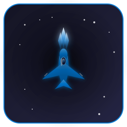

<div align="center">



# StarWing - 飞机大战

**一款基于 HTML5 Canvas 的飞机射击游戏**

*支持键盘、鼠标和手势三种操控模式*

[](https://github.com/Jay-Victor/StarWing)
[](LICENSE)
[](https://github.com/Jay-Victor/StarWing)
[](https://qm.qq.com/cgi-bin/qm/qr?k=YOUR_QQ_GROUP_KEY)
[](https://github.com/Jay-Victor/StarWing)
[](https://gitee.com/Jay-Victor/star-wing)

[English](#english) | [中文](#中文)

</div>

---

## 中文

### 📖 游戏介绍

#### 背景故事

公元2150年，地球文明遭到来自未知星系的外星势力入侵。这些被称为"星际收割者"的神秘生物驾驶着先进的战机，试图征服太阳系。作为地球联防军的精英飞行员，你的使命是驾驶最先进的战斗机，击退入侵者，保卫人类家园。

#### 游戏目标

- 击毁不断来袭的敌机，获取最高分数
- 收集各种特殊道具，提升战斗能力
- 挑战更高难度，突破自我极限
- 达成最高连击数，成为王牌飞行员

### 🎮 操作说明

#### 键盘模式 (WASD)

| 按键 | 功能 |
|------|------|
| W | 向上移动 |
| A | 向左移动 |
| S | 向下移动 |
| D | 向右移动 |
| Space | 发射激光 |
| P | 暂停/继续游戏 |
| M | 切换控制模式 |
| G | 切换手势面板 |
| ESC | 返回主菜单 |

#### 鼠标跟随模式

| 操作 | 功能 |
|------|------|
| 移动鼠标 | 控制飞机位置 |
| 按住左键 | 连续射击 |
| 松开左键 | 停止射击 |

#### 手势操控模式

| 手势 | 功能 |
|------|------|
| 移动食指 | 控制飞机位置 |
| 握拳 | 自动射击 |
| 张开手掌 | 停止射击 |

> **注意**: 手势模式需要摄像头权限，请确保已授权摄像头访问。

### 🎯 游戏特色

#### 得分系统
- 击毁敌机获得 **10分** 基础分
- 连续击杀可获得连击加成（最高可达 **1.5倍**）
- 收集 **⭐得分加倍** 道具，分数翻倍

#### 等级系统
- 每 **30秒** 自动升级
- 等级越高，敌机越强大
- 敌机攻击频率和速度都会提升

#### 生命值系统
- 初始生命值：**100**
- 被敌机撞击：**-20**
- 被敌机子弹击中：**-10**
- 生命值归零则游戏结束

#### 特殊道具

| 道具 | 效果 |
|------|------|
| ⚡ 激光升级 | 提升武器威力（最高3级） |
| 🛡️ 护盾 | 抵挡一次伤害 |
| ⭐ 得分加倍 | 分数翻倍效果 |
| ✨ 无敌状态 | 短暂时间内免受伤害 |

### 🔄 自动更新机制

StarWing 内置了完善的自动更新系统，确保您始终使用最新版本。

#### 更新方式

| 方式 | 说明 |
|------|------|
| 自动检查 | 应用启动后5秒自动检查，之后每24小时检查一次 |
| 手动检查 | 帮助菜单 → 检查更新... |
| 更新提示 | 发现新版本时弹出更新窗口 |

#### ⚡ 增量更新（v1.1.0 新增）

StarWing v1.1.0 引入了**增量更新**功能，大幅减少更新下载时间：

| 特性 | 说明 |
|------|------|
| 智能差异检测 | 只下载变化的文件块，无需下载完整安装包 |
| 流量节省 | 平均可节省 50-80% 的下载流量 |
| 多镜像支持 | 支持 GitHub、Gitee、CDN 多源下载 |
| 自动回退 | 增量更新失败时自动切换到完整更新 |

#### 更新流程

```
1. 检查更新 → 2. 发现新版本 → 3. 检测增量更新可用
      ↓
4. 选择更新方式 → 5. 多镜像下载 → 6. SHA256校验
      ↓
7. 自动备份 → 8. 启动安装 → 9. 完成更新
```

#### 多镜像下载支持

| 镜像源 | 优先级 | 说明 |
|--------|--------|------|
| GitHub | 1 | 官方源，全球可用 |
| Gitee直连 | 2 | 国内加速，推荐国内用户 |
| 国内CDN | 3 | 备用源 |

#### 更新配置

配置文件位置：`%APPDATA%/starwing/update-config.json`

```json
{
  "autoCheckEnabled": true,
  "checkInterval": 86400000,
  "backupEnabled": true,
  "deltaUpdateEnabled": true,
  "preferDelta": true
}
```

### 💻 系统要求

#### 最低配置
- **操作系统**: Windows 10 (64位) 或更高版本
- **处理器**: Intel Core i3 或同等性能处理器
- **内存**: 4 GB RAM
- **显卡**: Intel HD Graphics 4000 或更高
- **存储空间**: 200 MB 可用空间
- **网络**: 用于更新检查和手势识别功能（可选）

#### 推荐配置
- **操作系统**: Windows 11 (64位)
- **处理器**: Intel Core i5 或更高
- **内存**: 8 GB RAM
- **显卡**: NVIDIA GTX 1050 或更高
- **存储空间**: 200 MB 可用空间
- **摄像头**: 用于手势操控功能（可选）

### 📥 下载安装

#### 方式一：直接下载安装包

| 平台 | 下载地址 |
|------|----------|
| **GitHub** | [Releases 页面](https://github.com/Jay-Victor/StarWing/releases) |
| **Gitee（国内推荐）** | [Releases 页面](https://gitee.com/Jay-Victor/star-wing/releases) |

#### 方式二：从源码构建

```bash
# 从 GitHub 克隆
git clone https://github.com/Jay-Victor/StarWing.git

# 或从 Gitee 克隆（国内推荐）
git clone https://gitee.com/Jay-Victor/star-wing.git

# 进入项目目录
cd StarWing

# 安装依赖
npm install

# 构建应用
npm run build
```

### 🔧 技术栈

| 技术 | 说明 |
|------|------|
| Electron 28.1.0 | 桌面应用框架 |
| HTML5 Canvas | 游戏渲染引擎 |
| MediaPipe Hands | 手势识别 |
| WinUI3 Design | UI 设计系统 |

### 📋 版本历史

查看 [CHANGELOG.md](CHANGELOG.md) 了解详细的版本更新记录。

### � 项目结构

查看 [DIRECTORY_STRUCTURE.md](DIRECTORY_STRUCTURE.md) 了解项目目录结构说明。

### 👨‍💻 开发者信息

- **开发者**: Jay-Victor
- **GitHub**: https://github.com/Jay-Victor/StarWing
- **Gitee**: https://gitee.com/Jay-Victor/star-wing

### 💬 技术交流

技术交流QQ群：**1080243162**

欢迎加入QQ群进行技术讨论、问题反馈和建议交流！

### ☕ 支持项目

如果您觉得这个项目对您有帮助，欢迎请开发者喝杯咖啡 ☕

<div align="center">

| 微信支付 | 支付宝 |
|:---:|:---:|
|  |  |

</div>

您的支持是我们持续改进的动力！感谢每一位支持者！❤️

#### 💝 打赏名单

感谢以下热心用户的支持（按打赏时间排序）：

| 序号 | 打赏账户 | 打赏日期 | 打赏金额（元） |
|:---:|:---:|:---:|:---:|
| 1 | ＨonEy°念 | 2026-03-11 22:17:05 | 20.00 |

### 📄 开源协议

本项目采用 [StarWing 自定义开源协议](LICENSE)，主要条款包括：

- 🚫 禁止商业用途
- ✅ 允许二次开发
- 🎨 必须标明原作者
- 🔓 二次开发必须开源

### 🤝 贡献指南

欢迎参与项目贡献！请阅读 [CONTRIBUTING.md](CONTRIBUTING.md) 了解详情。

### ❓ 常见问题

#### Q1: 游戏无法启动怎么办？
**A**: 请确保已安装最新版本的 DirectX 和显卡驱动。如果问题仍然存在，请尝试以管理员身份运行游戏。

#### Q2: 手势模式无法使用？
**A**: 请检查以下几点：
1. 确保已授予浏览器/应用摄像头权限
2. 检查摄像头是否被其他应用程序占用
3. 确保光线充足，手势清晰可见
4. 尝试调整手势灵敏度设置

#### Q3: 游戏运行缓慢或卡顿？
**A**: 尝试以下解决方案：
1. 关闭其他后台应用程序
2. 降低游戏画质设置
3. 更新显卡驱动程序
4. 确保系统满足最低配置要求

#### Q4: 如何关闭自动更新检查？
**A**: 编辑 `%APPDATA%/starwing/update-config.json` 文件，将 `autoCheckEnabled` 设置为 `false`。

#### Q5: 更新下载失败怎么办？
**A**: 系统会自动尝试多个镜像源。如果全部失败，请手动前往以下页面下载：
- [GitHub Releases](https://github.com/Jay-Victor/StarWing/releases)
- [Gitee Releases](https://gitee.com/Jay-Victor/star-wing/releases)

---

## English

### 📖 Introduction

#### Background Story

In the year 2150, Earth's civilization faces invasion from an unknown alien force. These mysterious beings, known as "Star Reapers," pilot advanced fighter craft in an attempt to conquer the solar system. As an elite pilot of Earth's Defense Force, your mission is to pilot the most advanced fighter jet and repel the invaders to protect humanity's home.

#### Game Objectives

- Destroy incoming enemy aircraft to achieve the highest score
- Collect various power-ups to enhance combat capabilities
- Challenge higher difficulties and push your limits
- Achieve the highest combo count to become an ace pilot

### 🎮 Controls

#### Keyboard Mode (WASD)

| Key | Function |
|-----|----------|
| W | Move Up |
| A | Move Left |
| S | Move Down |
| D | Move Right |
| Space | Fire Laser |
| P | Pause/Resume |
| M | Switch Control Mode |
| G | Toggle Gesture Panel |
| ESC | Return to Main Menu |

#### Mouse Following Mode

| Action | Function |
|--------|----------|
| Move Mouse | Control aircraft position |
| Hold Left Button | Continuous fire |
| Release Left Button | Stop firing |

#### Gesture Control Mode

| Gesture | Function |
|---------|----------|
| Move Index Finger | Control aircraft position |
| Make Fist | Auto fire |
| Open Palm | Stop firing |

> **Note**: Gesture mode requires camera permission. Please ensure camera access is authorized.

### 🎯 Game Features

#### Scoring System
- Destroy enemies for **10 points** base score
- Consecutive kills earn combo bonus (up to **1.5x**)
- Collect **⭐ Score Double** power-up to double your points

#### Level System
- Auto-upgrade every **30 seconds**
- Higher levels mean stronger enemies
- Enemy attack frequency and speed increase

#### Health System
- Initial Health: **100**
- Enemy collision: **-20**
- Enemy bullet hit: **-10**
- Game over when health reaches zero

#### Power-ups

| Power-up | Effect |
|----------|--------|
| ⚡ Laser Upgrade | Increase weapon power (max level 3) |
| 🛡️ Shield | Block one hit |
| ⭐ Score Double | Double score effect |
| ✨ Invincibility | Temporary immunity to damage |

### 🔄 Auto-Update Mechanism

StarWing includes a comprehensive auto-update system to ensure you always have the latest version.

#### Update Methods

| Method | Description |
|--------|-------------|
| Auto Check | Check 5 seconds after startup, then every 24 hours |
| Manual Check | Help menu → Check for Updates... |
| Update Prompt | Show update window when new version is found |

#### ⚡ Delta Update (New in v1.1.0)

StarWing v1.1.0 introduces **Delta Update** functionality, significantly reducing update download time:

| Feature | Description |
|---------|-------------|
| Smart Difference Detection | Only download changed file blocks, no need for full installer |
| Bandwidth Savings | Average 50-80% download bandwidth savings |
| Multi-mirror Support | Supports GitHub, Gitee, CDN multi-source downloads |
| Auto Fallback | Automatically switches to full update when delta update fails |

#### Update Process

```
1. Check Update → 2. New Version Found → 3. Check Delta Update Available
       ↓
4. Choose Update Method → 5. Multi-mirror Download → 6. SHA256 Verify
       ↓
7. Auto Backup → 8. Launch Installer → 9. Complete Update
```

#### Multi-mirror Download Support

| Mirror | Priority | Description |
|--------|----------|-------------|
| GitHub | 1 | Official source, globally available |
| Gitee Direct | 2 | China acceleration, recommended for CN users |
| China CDN | 3 | Backup source |

#### Update Configuration

Config file location: `%APPDATA%/starwing/update-config.json`

```json
{
  "autoCheckEnabled": true,
  "checkInterval": 86400000,
  "backupEnabled": true,
  "deltaUpdateEnabled": true,
  "preferDelta": true
}
```

### 💻 System Requirements

#### Minimum
- **OS**: Windows 10 (64-bit) or higher
- **Processor**: Intel Core i3 or equivalent
- **Memory**: 4 GB RAM
- **Graphics**: Intel HD Graphics 4000 or higher
- **Storage**: 200 MB available space
- **Network**: For update check and gesture recognition (optional)

#### Recommended
- **OS**: Windows 11 (64-bit)
- **Processor**: Intel Core i5 or higher
- **Memory**: 8 GB RAM
- **Graphics**: NVIDIA GTX 1050 or higher
- **Storage**: 200 MB available space
- **Camera**: For gesture control (optional)

### 📥 Download & Install

#### Option 1: Direct Download

| Platform | Download Link |
|----------|---------------|
| **GitHub** | [Releases Page](https://github.com/Jay-Victor/StarWing/releases) |
| **Gitee (Recommended for China)** | [Releases Page](https://gitee.com/Jay-Victor/star-wing/releases) |

#### Option 2: Build from Source

```bash
# Clone from GitHub
git clone https://github.com/Jay-Victor/StarWing.git

# Or clone from Gitee (Recommended for China)
git clone https://gitee.com/Jay-Victor/star-wing.git

# Navigate to project directory
cd StarWing

# Install dependencies
npm install

# Build the application
npm run build
```

### 🔧 Tech Stack

| Technology | Description |
|------------|-------------|
| Electron 28.1.0 | Desktop application framework |
| HTML5 Canvas | Game rendering engine |
| MediaPipe Hands | Gesture recognition |
| WinUI3 Design | UI design system |

### 📋 Version History

See [CHANGELOG.md](CHANGELOG.md) for detailed version updates.

### 👨‍💻 Developer

- **Developer**: Jay-Victor
- **GitHub**: https://github.com/Jay-Victor/StarWing
- **Gitee**: https://gitee.com/Jay-Victor/star-wing

### 💬 Community

QQ Group for Technical Discussion: **1080243162**

Join our QQ group for technical discussions, feedback, and suggestions!

### ☕ Support the Project

If you find this project helpful, consider buying the developer a coffee ☕

<div align="center">

| WeChat Pay | Alipay |
|:---:|:---:|
|  |  |

</div>

Your support is our motivation to keep improving! Thank you to all supporters! ❤️

#### 💝 Donor List

Thanks to the following supporters (sorted by donation date):

| No. | Donor | Date | Amount (CNY) |
|:---:|:---:|:---:|:---:|
| 1 | ＨonEy°念 | 2026-03-11 22:17:05 | 20.00 |

### 📄 License

This project uses the [StarWing Custom Open Source License](LICENSE), which includes:

- 🚫 No commercial use
- ✅ Derivative development allowed
- 🎨 Attribution required
- 🔓 Derivative works must be open source

### 🤝 Contributing

Contributions are welcome! Please read [CONTRIBUTING.md](CONTRIBUTING.md) for details.

### ❓ FAQ

#### Q1: The game won't start, what should I do?
**A**: Make sure you have the latest version of DirectX and graphics drivers installed. If the problem persists, try running the game as administrator.

#### Q2: Gesture mode doesn't work?
**A**: Please check the following:
1. Ensure camera permission is granted
2. Check if the camera is being used by another application
3. Ensure adequate lighting and clear gesture visibility
4. Try adjusting gesture sensitivity settings

#### Q3: Game runs slowly or lags?
**A**: Try these solutions:
1. Close other background applications
2. Lower game graphics settings
3. Update graphics drivers
4. Ensure your system meets minimum requirements

#### Q4: How to disable auto-update check?
**A**: Edit `%APPDATA%/starwing/update-config.json` file and set `autoCheckEnabled` to `false`.

#### Q5: Update download failed?
**A**: The system will automatically try multiple mirror sources. If all fail, please manually download from:
- [GitHub Releases](https://github.com/Jay-Victor/StarWing/releases)
- [Gitee Releases](https://gitee.com/Jay-Victor/star-wing/releases)

---

<div align="center">

**感谢您选择 StarWing！Thank you for choosing StarWing!**

*祝您游戏愉快，飞行顺利！Enjoy the game and happy flying!*

⭐ 如果您喜欢这个项目，请给一个 Star！If you like this project, please give it a Star! ⭐

</div>
